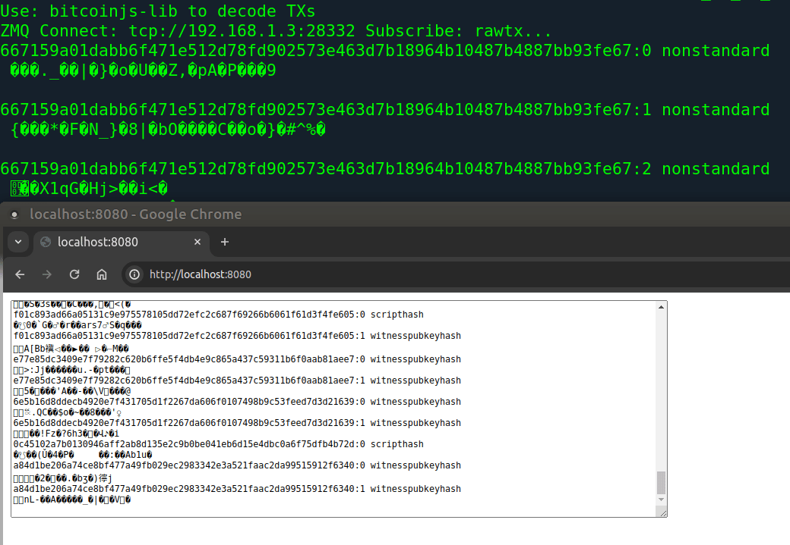

# bitcoin-nodejs-playground
Show in the browser any transaction for your Bitcoin Full Node

## requirements:
on bitcoin.conf enable this line:
zmqpubrawtx=tcp://127.0.0.1:28332

npm install zeromq bitcoinjs-lib fastify @fastify/websocket

### optionals:
command line utility(part of bitcoin-core): `bitcoin-tx`

specify HOST of Bitcoin
```bash
$ HOST=192.168.1.3
$ node zmq_tx_ws_fastify.js 
```



Donations ❤️ via Lightning Network ⚡ to incentivize development and bug fixes of my repos

[](https://getalby.com/p/st3b1t)
