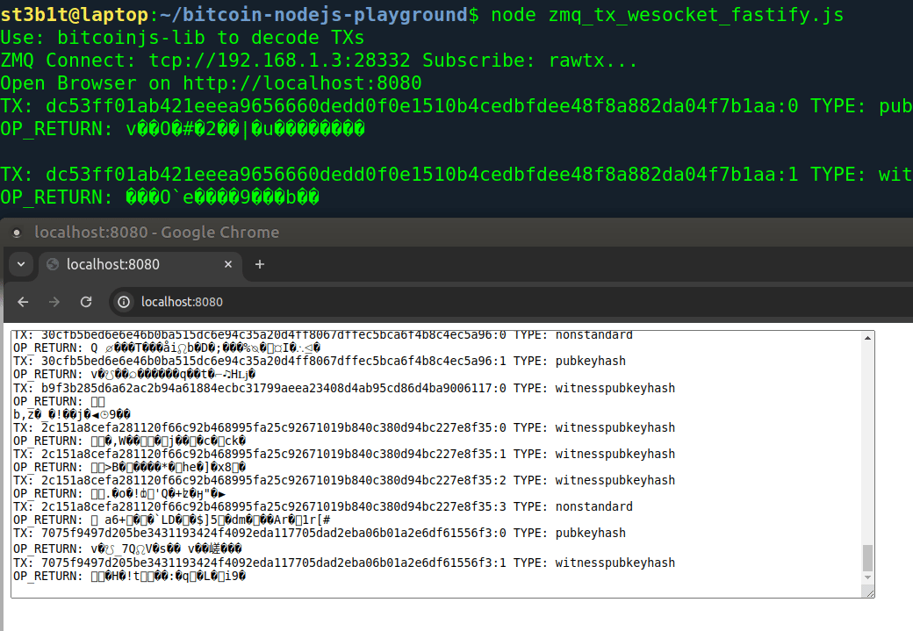
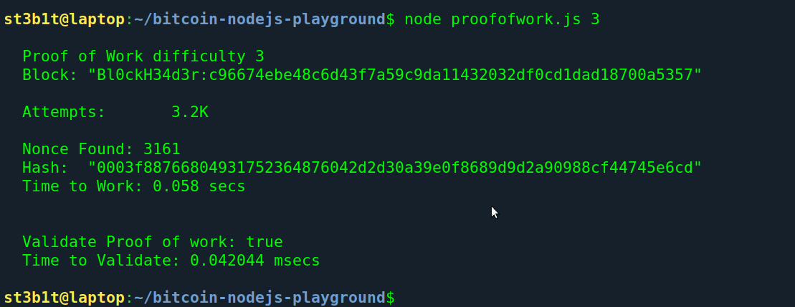
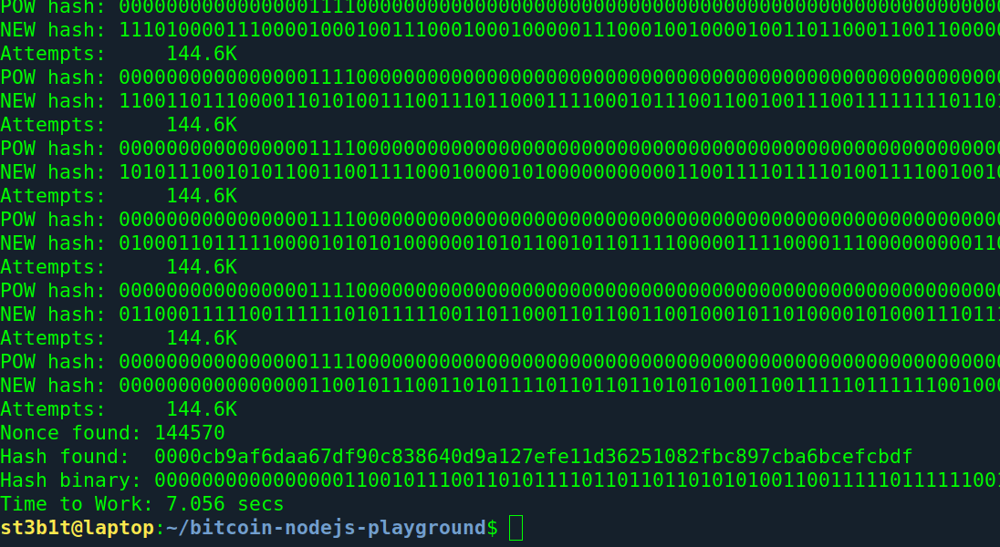

# Bitcoin Nodejs Playground

## 1. Stream Transactions and OP_RETURN

Stream in the browser via WebSocket any transaction and OP_RETURN of your Bitcoin Full Node from [ZeroMQ](https://github.com/zeromq/zeromq.js/) interface
Server side written in NodeJs [Fastify](https://github.com/fastify) and [BitcoinJs-lib](https://github.com/bitcoinjs/bitcoinjs-lib)

### Requirements:
Add in `bitcoin.conf` enable this line:
zmqpubrawtx=tcp://127.0.0.1:28332

npm install zeromq bitcoinjs-lib fastify @fastify/websocket

```bash
$ npm install
```

#### Optionals:
command line utility(part of bitcoin-core): `bitcoin-tx`

### RUN
specify HOST of Bitcoin and ZeroMQ port

```bash
$ export HOST=127.0.0.1 PORT=28332
$ node zmq_tx_websocket_fastify.js
```



---

## 2. Proof Of Work

```bash
$ node proofofwork.js
```



## 3. Proof Of Work Binary comparison

The hash comparison occurs at the binary level, allows greater granularity of target diffucilty

```bash
$ node proofofwork_bonary.js
```



# Donate ❤️ sats via LN ⚡ to incentivize work of this repository

[](https://getalby.com/p/st3b1t)

